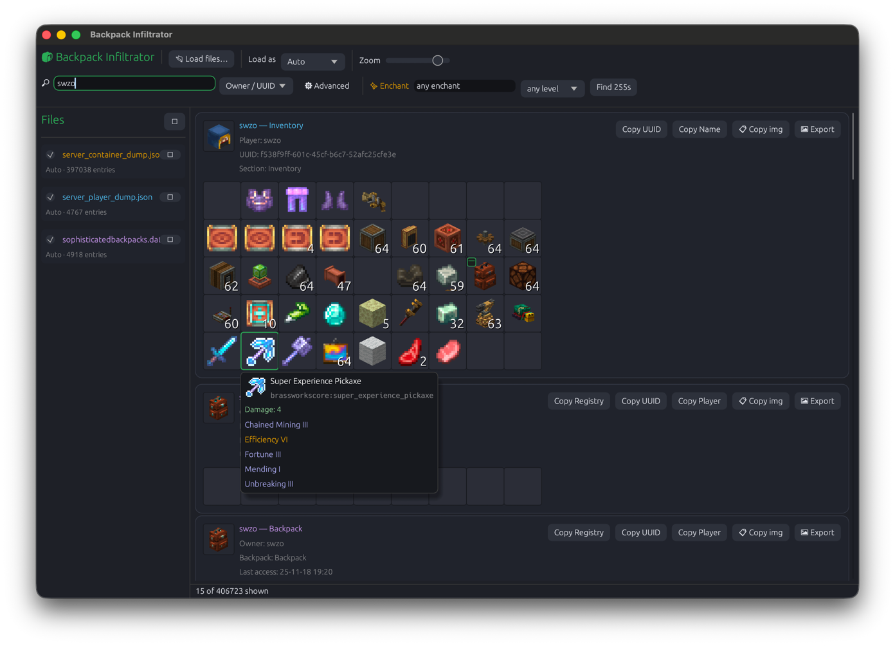

# Backpack Infiltrator

A desktop app for the Brassworks SMP mods that lets you search through every
container, backpack, and inventory on the server. It reads the dumps created by
the Brassworks Core mod and shows them all in one window - with search, item
tooltips, nested container contents, and real 3D player heads.



## What it reads

- `sophisticatedbackpacks.dat` - your backpacks (from `world/data/` in your save)
- `*_container_dump.json` - world containers like chests, barrels, and shulkers
- `*_player_dump.json` - player inventories and ender chests

Just drag any of these onto the window, or use the "Load files" button. You can
load several at once - loading the backpacks `.dat` alongside a dump also lets
you see the contents of backpacks sitting inside other inventories.

## First-time setup

The item sprites are too big to keep in this repo, so you grab them from the
Brassworks modpack once:

1. In-game, run `brassworks dump itematlas`.
2. This now creates a single `brass_atlas.zip` in the `brass_dump` folder in
   your Minecraft instance root (it used to write a separate `atlas_map.json`
   and `item_atlas.png` - it's one bundled `.zip` now).
3. In the app, use the **Sprites** panel on the left to select that
   `brass_atlas.zip`. The choice is remembered, and you can swap it any time
   with **Change atlas…**.

Everything else (fonts, glint, UI art) is embedded in the program, so there's
no `assets/` folder to copy around - just the one atlas `.zip` you pick.

## Running it

```bash
cargo run --release
```

To just build it without running:

```bash
cargo build
```

`cargo build` puts the program at `target/debug/infiltrator`, and
`cargo run --release` builds a faster version at `target/release/infiltrator`.
The binary is self-contained; the only external file it needs is the
`brass_atlas.zip` you select in the app.

## Terminal helpers

If you'd rather not open the window, these run straight from the terminal:

```bash
infiltrator --parse <file>                       # print a quick summary of a file
infiltrator --png <file> [out.png]               # save the fullest entry as an image
infiltrator --head <skin.png> <out.png> [size]   # render a 3D head from a skin
infiltrator --inspect <id-substr> <file>         # dump raw NBT of matching items
```

`--png` draws item sprites, so it looks for a `brass_atlas.zip` in the current
directory (or next to the binary).
